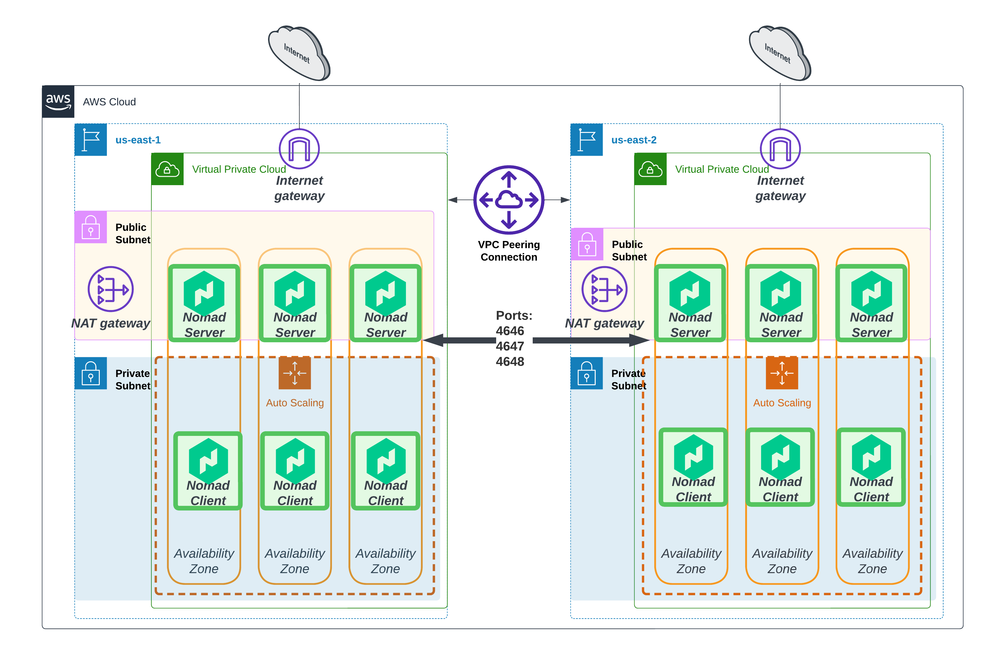

# Nomad multi-region deployment

## Diagram


## This repo contains code for deploying Nomad clusters across multiple cloud regions

## Usage

###Add ssh-key to AWS regions

```
ssh-keygen -y -f ahar-keypair-2023.pem > $HOME/.ssh/id_rsa_MyKeyPair.pub
AWS_REGIONS="$(aws ec2 describe-regions --query 'Regions[].RegionName' --output text)"]
#uncomment if using zsh shell
setopt shwordsplit
for each_region in ${AWS_REGIONS} ; do aws ec2 import-key-pair --key-name ahar-keypair-2024 --public-key-material fileb://$HOME/.ssh/id_rsa_MyKeyPair.pub --region $each_region ; done
```

###Build AMI using Packer

```
cd packer
packer init image.pkr.hcl
packer build -var-file=variables-packer.hcl image.pkr.hcl
cd ..
```

### Deploy Infrastructure with Terraform
```
#terraform destroy --auto-approve
terraform apply --auto-approve
rm nomad.token
rm nomad2.token
rm nomad1.token
./post-setup.sh
ssh -i ahar-keypair-2023.pem ubuntu@$(terraform output -raw "region_1_server_ip")

```

### Output Example
```
Apply complete! Resources: 1 added, 0 changed, 0 destroyed.

Outputs:

consul_bootstrap_token_secret = "8f966fde72-d76a-2f4d-5b97-e7c9fafa8d"
region_1_nomad_ui = "http://35.221.181.49:4646"
region_1_server_ip = "35.221.181.49"
region_1_vpc_id = "vpc-01g98f754c309be2d"
region_2_nomad_ui = "http://19.221.215.253:4646"
region_2_server_ip = "19.221.215.253"
region_2_vpc_id = "vpc-0fd824260c5035522"

```

### Connecting to Instances
```
ssh -i ahar-keypair-2023.pem ubuntu@$(terraform output -raw "region_1_server_ip")
```

### Troubleshooting
```
cat /var/log/syslog
```